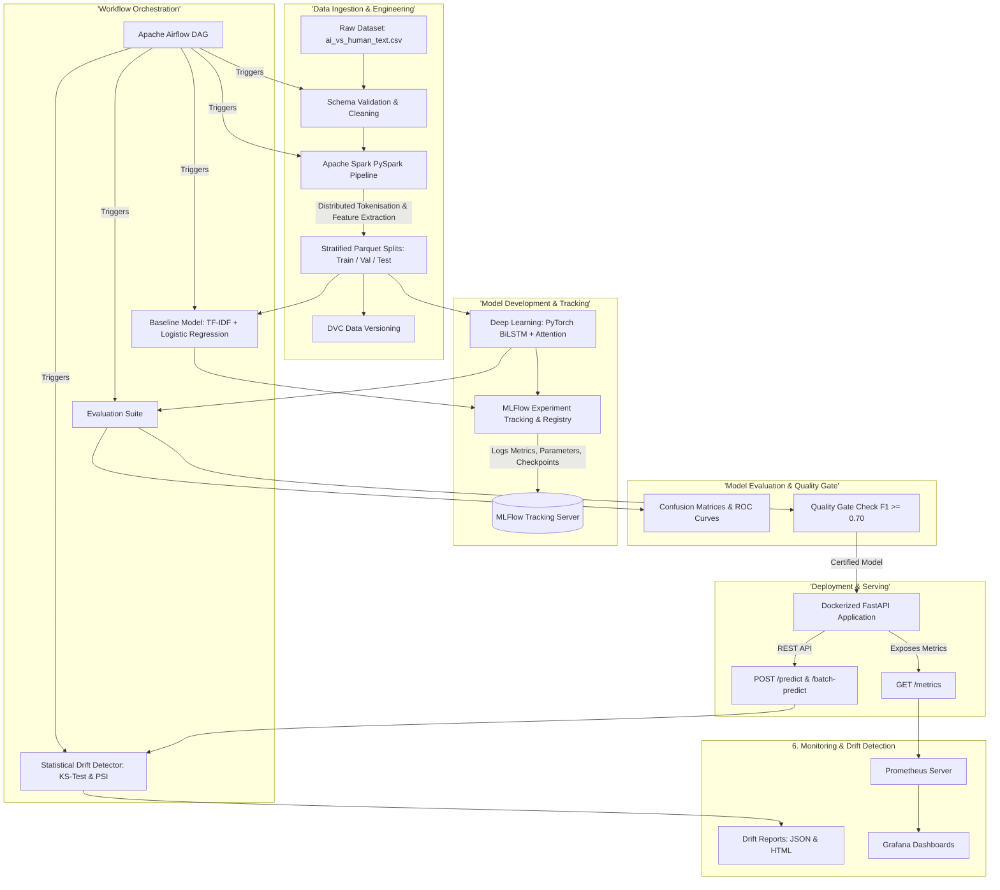

# End-to-End MLOps Pipeline for AI vs Human News Classification

[](https://github.com/aditi-govindu/mlops-final-term-project/actions)
[](https://www.python.org/downloads/)
[](https://pytorch.org/)
[](https://spark.apache.org/)
[](https://airflow.apache.org/)
[](https://mlflow.org/)
[](https://fastapi.tiangolo.com/)
[](https://www.docker.com/)

## Contributors
* Lavanya Srinivasan Ramadurai
* Arvind M Raja
* G K Sreevineeth
* Aditi Govindu
---

## About

With the rapid use of Large Language Models (LLMs) like GPT-4, Claude, ChatGPT, and Bard, distinguishing between AI and human-authored news articles has become essential for media authenticity and reducing misinformation. We attempt to build a pipeline to classify media articles as human or AI using a ML model.

This repository implements a **production-grade, end-to-end Machine Learning Operations (MLOps) system** designed to classify pre-labeled texts into:
1. **`AI-generated` (Class 1)**: Content generated by generative AI / LLMs.
2. **`Human-written` (Class 0)**: Authentic human-authored news article.

## Components used and their purpose

| Expected deliverable | Tools used | Implementation Details |
| :--- | :--- | :--- |
| **Version Control** | Git & GitHub | Modular architecture, branch workflows, and clean commit history. |
| **Orchestration** | **Apache Airflow** | DAG: `mlops_ai_vs_human_classification_pipeline` executing end-to-end tasks with retries and dependency graphs. |
| **Data Engineering** | **Apache Spark (PySpark)** | Distributed cleaning, tokenization (`RegexTokenizer`), stopword filtering (`StopWordsRemover`), lexical diversity (TTR), word length distributions. |
| **Data Processing** | Python & Spark ML | Missing value imputation, URL/HTML sanitization, Type-Token Ratio, uppercase/punctuation densities, stratified train/val/test splitting. |
| **Model Development** | **PyTorch & Scikit-Learn** | **Baseline**: TF-IDF + Logistic Regression.<br> **Deep Learning**: PyTorch BiLSTM with Additive Self-Attention and Lexical Feature Fusion. |
| **Experiment Tracking** | **MLflow** | Parameter tracking (LR, epochs, hidden dims), per-epoch metric curves (loss, accuracy, F1, ROC-AUC), model registry logging. |
| **Data & Model Versioning**| **DVC** | `dvc.yaml` tracking stages (`ingest`, `preprocess`, `train`, `evaluate`, `drift_detection`). |
| **Deployment** | **FastAPI & Docker** | Asynchronous REST API with Swagger UI docs, health checks, and Docker containerization. |
| **Monitoring** | **Prometheus & Drift Detector**| Request count, latency histograms, prediction distribution counters, and Kolmogorov-Smirnov statistical data drift analysis. |
| **CI/CD** | **GitHub Actions** | Automated linting (`black`, `flake8`), unit tests (`pytest`), pipeline validation dry run, and Docker image build test. |


---

## System Architecture

The architecture represents an automated, reproducible MLOps lifecycle from raw ingestion to production monitoring:



---

## Quick Start & Execution Guide

### Prerequisites
- Python 3.9+
- Docker & Docker Compose (optional for containerized deployment)

### Local Environment Setup
```bash
# 1. Clone repository
git clone https://github.com/aditi-govindu/mlops-final-term-project.git
cd mlops-final-term-project

# 2. Create virtual environment
python3 -m venv venv
source venv/bin/activate

# 3. Install dependencies
pip install --upgrade pip
pip install -r requirements.txt
```

### Run the Pipeline via Standalone Scripts
You can execute the entire pipeline with a single `make` command:
```bash
make pipeline
```

Or execute individual stages:
```bash
# Step 1: Data Ingestion & Schema Validation
python3 src/data/ingest.py

# Step 2: Feature Engineering & Preprocessing (or via Spark: python3 src/data/spark_preprocess.py)
python3 src/data/preprocess.py

# Step 3: Train Baseline & PyTorch Models with MLflow Tracking
python3 src/models/train.py

# Step 4: Evaluate Models & Generate Confusion Matrices / ROC Curves
python3 src/models/evaluate.py

# Step 5: Run Statistical Data Drift Monitoring
python3 src/monitoring/drift_detector.py
```

### Launch MLflow Experiment Tracking UI
```bash
mlflow ui --host 0.0.0.0 --port 5000 --backend-store-uri sqlite:///mlruns.db
```
Open **[http://localhost:5000](http://localhost:5000)** in your browser to inspect runs, compare hyperparameters, and view loss curves.

---

## Serving the Model via FastAPI

### Start the API Server
```bash
uvicorn src.api.app:app --host 0.0.0.0 --port 8000 --reload
```
Interactive Swagger API documentation is available at: **[http://localhost:8000/docs](http://localhost:8000/docs)**.

### API Endpoints & cURL Examples

#### Single Prediction (`POST /predict`)
```bash
curl -X POST http://localhost:8000/predict \
  -H "Content-Type: application/json" \
  -d '{
    "text": "Deep learning models such as transformers have revolutionized natural language understanding and generation across diverse domain tasks."
  }'
```
**Sample Response:**
```json
{
  "text_snippet": "Deep learning models such as transformers have revolutionized natural language understanding...",
  "predicted_label": "AI-generated",
  "confidence_score": 0.9421,
  "probability_ai": 0.9421,
  "latency_ms": 14.32,
  "lexical_features": {
    "char_length": 136.0,
    "word_count": 17.0,
    "avg_word_length": 7.05,
    "lexical_diversity": 1.0,
    "punctuation_count": 1.0,
    "uppercase_ratio": 0.0074
  },
  "model_type": "PyTorch_BiLSTM_Attention",
  "model_version": "1.0.0"
}
```

#### Batch Prediction (`POST /batch-predict`)
```bash
curl -X POST http://localhost:8000/batch-predict \
  -H "Content-Type: application/json" \
  -d '{
    "texts": [
      "The city council convened yesterday to discuss local infrastructure improvements and municipal budgets.",
      "As an AI language model, I synthesize context across vast parameter sets to predict next-token distributions."
    ]
  }'
```

#### Prometheus Metrics Endpoint (`GET /metrics`)
```bash
curl -X GET http://localhost:8000/metrics
```
Exposes real-time metrics including `http_requests_total`, `http_request_duration_seconds`, `predictions_total`, and `prediction_confidence_score`.

---

## Docker & Multi-Container Deployment

Run the complete production stack (FastAPI, MLflow, Airflow, Prometheus, Grafana) with Docker Compose:

```bash
# Build and spin up all containers
docker-compose up -d --build
```

### Deployed Services:
- **FastAPI Model Service**: [http://localhost:8000](http://localhost:8000) (Docs: `/docs`)
- **Apache Airflow Webserver**: [http://localhost:8080](http://localhost:8080) (User: `admin`, Pass: `admin`)
- **MLflow Tracking UI**: [http://localhost:5000](http://localhost:5000)
- **Prometheus Metrics Aggregator**: [http://localhost:9090](http://localhost:9090)
- **Grafana Visualization Dashboards**: [http://localhost:3000](http://localhost:3000) (User: `admin`, Pass: `admin`)

To stop all services:
```bash
docker-compose down
```

---

## Automated Testing & Quality Checks

Run the automated test suite with coverage reporting:
```bash
pytest --cov=src --cov-report=term-missing tests/
```

Run code formatting and linting:
```bash
flake8 src/ tests/ --max-line-length=120
black --check --line-length=120 src/ tests/
```

---
